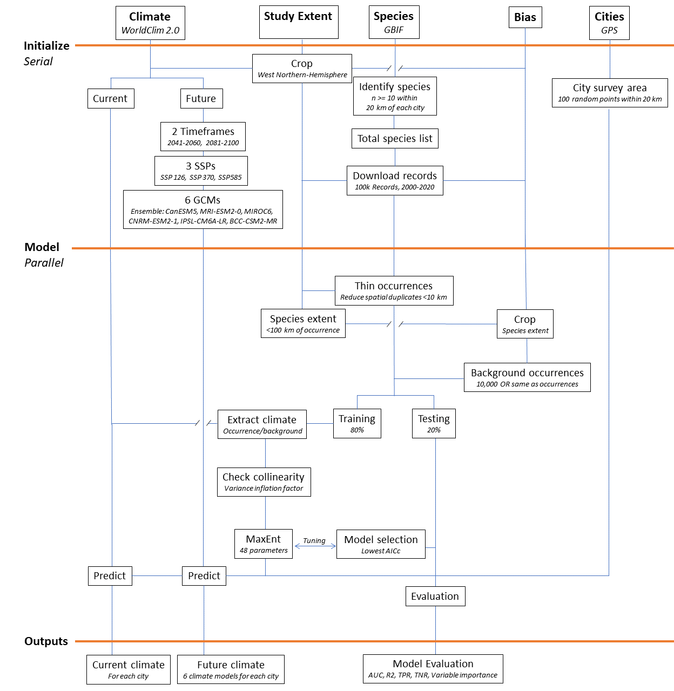

### Analyze results

```{r warning=FALSE, message=FALSE}
## Libraries
library(tidyverse)
library(ggridges)
```

```{r}
## Look at the model results
models <- list.files("out//models//", full.names = T)

listModels <- lapply(1:length(models), function(i)
  read.csv(models[i], stringsAsFactors = F)
)
allModels <- do.call(plyr::rbind.fill, listModels)


### Model checks to ensure none are poor qualifiers
hist(allModels$AUCtrain)
hist(allModels$AUCtest)

## Drop models where AUC < 0.7
bestModels <- allModels %>% filter(AUCtest > 0.7)
ggplot(bestModels, aes(x=AUCtest, y=AUCtrain)) + geom_point()

## Correct missing taxa in Arachnids and filter out aquatic species
bestModels$Class <- ifelse(bestModels$Order == "Araneae" |  ## Add arachnida Class to grouping where missing
             bestModels$Order == "Ixodida" | 
             bestModels$Order == "Opiliones" |
             bestModels$Order == "Scorpiones" |
             bestModels$Order == "Trombidiformes", "Arachnida",bestModels$Class)
bestModels$Class <- ifelse(bestModels$Family == "Entomobryidae" | bestModels$Family == "Orchesellidae","Entognatha",bestModels$Class)
terrestrial1 <- bestModels %>%  
  filter(Phylum %in% c("Arthropoda","Chordata")) %>% 
  filter(!(Class %in% c("Actinopterygii","Ascidiacea","Elasmobranchii","Merostomata","Malacostraca","Maxillopoda"))) %>% 
  filter(!(Family %in% c("Otariidae","Delphinidae","Trichechidae","Phocidae","Balaenopteridae"))) %>% 
  filter(species != "Enhydra lutris")
terrestrial2 <- bestModels %>%  
  filter(Class %in% c("Gastropoda", "Clitellata")) %>% 
  filter(Order %in% c("Stylommatophora","Systellommatophora","Cycloneritida","Crassiclitellata")) %>% 
  filter(!(Family %in% c("Neritopsidae","Titiscaniidae","Neritidae","Phenacolepadidae")))
terrestrial <- rbind(terrestrial1, terrestrial2)

### Total number of observations
sum(terrestrial$nobs)/1000000 ## total number of observations
median(terrestrial$nobs) ## average number of observations per species
sd(terrestrial$nobs)/sqrt(nrow(terrestrial)) ## Error
min(terrestrial$nobs)
max(terrestrial$nobs)

## Look at predictions for cities
futureclimate <- list.files("out//cityPredict//", full.names = T, pattern="Future")

listFuture <- lapply(1:length(futureclimate), function(i)
  read.csv(futureclimate[i], stringsAsFactors = F)
)
allFuture <- do.call(rbind, listFuture)

currentclimate <- list.files("out//cityPredict//", full.names = T, pattern="Current")

listCurrent <- lapply(1:length(currentclimate), function(i)
  read.csv(currentclimate[i], stringsAsFactors = F)
)
allCurrent <- do.call(rbind, listCurrent)
```


## Combine future and current climate data frames
```{r}
allClimate <- allCurrent %>% dplyr::select(City, species, currentProb = meanProb) %>% left_join(allFuture) %>% 
  mutate(changeProb =  meanProb - currentProb, changeProb= round(changeProb, 4)) %>%  ## log(future/current) = LRR change in predicted occurrence
  filter(!is.na(SSP)) %>% filter(currentProb > 0.05)
allClimate <- allClimate %>% filter(species %in% terrestrial$species) ## remove species that had low model AUC

```


## Species unique to single cities
```{r}
allClimate %>% group_by(species) %>% summarize(nCity = length(unique(City)), cityName=unique(City)) %>% filter(nCity==1)

####### Define regions for cities that are most affected

cityStats <- read.csv("data//cityData//CityCharacteristics.csv") %>% dplyr::select(City = CityName, ecozone = NA_L1NAME, bio1:bio15, lon, lat)

modelClimateCity <- merge(allClimate, cityStats, by="City")


summarizedRegions <- modelClimateCity %>% group_by(ecozone, species, SSP, Year ) %>% summarize(diff=mean(changeProb))


ggplot(data=summarizedRegions, aes(x=diff, y= ecozone, fill=ecozone)) + geom_density_ridges(na.rm=T, stat="binline") + theme_ridges() + 
 theme_classic() + ylab("Change in Predicted Occurrence") + scale_fill_manual(values=RColorBrewer::brewer.pal(n=7, "Dark2")) +
  geom_hline(yintercept=0, lty=2) + geom_vline(xintercept = 0, lty=2) + facet_grid(Year~SSP)


### City map of globe
averageCity <- modelClimateCity %>% filter(!is.infinite(changeProb)) %>%  
  group_by(City, lat, lon,  SSP, Year ) %>% summarize(diff=mean(changeProb, na.rm=T))

## Take extreme year and discrete extremes
averageExtreme <- data.frame(averageCity) %>% filter(Year=="2081-2100")
averageExtreme[,"diffBin"] <- cut(averageExtreme$diff, breaks=seq(-0.5,0.2, by=0.1))

mp <- NULL
mapWorld <- borders("world", colour="white", fill="gray75") # create a layer of borders
mp <- ggplot() + theme_classic()+  mapWorld + xlim(-180,-30) + ylim(-20, 90)
RColorBrewer::brewer.pal(n=7, "RdYlBu")

mp <- mp+ geom_point(data=averageExtreme , aes(x=lon, y=lat, fill=diffBin),  size=3, pch=21) +
 ylab("Latitude") + xlab("Longitude")  + scale_fill_manual(values=c(RColorBrewer::brewer.pal(n=9, "RdYlBu")))
mp

```


##### Taxa plot to see differences among species
```{r}
## Differences in taxa
taxaInfo <- terrestrial %>% distinct(Phylum, Class, Order, Family, species)
taxaClimate <- merge(allClimate, taxaInfo, by="species" )
# write.csv(taxaClimate, "out//allSpeciesData.csv", row.names=FALSE)


taxaClimateSimplified <- taxaClimate %>% 
  filter(Year == "2081-2100" & SSP == "ssp585") 
taxaClimateSimplified <- taxaClimateSimplified %>% group_by(Order) %>% mutate(medianOrder = median(changeProb, na.rm=T), nOrder=length(changeProb)) %>% 
  ungroup()  %>%  group_by(Class) %>% mutate(medianClass = median(changeProb, na.rm=T), nClass=length(changeProb)) 


## Simple phylum plot
ggplot(taxaClimateSimplified,
      aes(y=Class, x= changeProb, fill=Class)) + 
  geom_density_ridges2(scale = 0.9, rel_min_height = 0.01) +
  theme_classic() + xlab("Difference in Predicted Occurrence") +
  geom_hline(yintercept=0, lty=2) + xlim(-1,1) +
  scale_fill_manual(values=c(RColorBrewer::brewer.pal(n=12, "Paired"), "black")) +
  geom_vline(xintercept = 0, lty=2)  + theme(text = element_text(size=24), legend.position = "none")

## N per grouping
taxaClimateSimplified %>%
    group_by(Class) %>% summarize(nSpp = length(unique(species)), nObs=length(species), nCityObs = nObs/nSpp)


### Extremes among taxa
extremePatterns <- taxaClimateSimplified %>%
  filter(Class == "Mammalia") %>% 
  group_by(species) %>% 
  summarize(avgChangeProb = mean(changeProb), nSpp = length(unique(species))) %>% 
  arrange(avgChangeProb) %>% data.frame()
extremePatterns
# write.csv(extremePatterns, "extremePatterns.csv", row.names=F)


### Bee declines in Raleigh
raleigh <- taxaClimateSimplified %>% filter(Order=="Hymenoptera") %>% 
  # filter(City=="Raleigh") %>%  
  filter(Family %in% c("Andrenidae","Apidae","Collectidae","Hallictidae","Megachilidae","Melittidae","Stenotritidae")) %>%  ## bee families
  summarize(avg=mean(changeProb))

## Patterns across taxa
familyAvg <- taxaClimateSimplified %>% filter(Phylum %in% c("Arthropoda","Chordata")) %>%
  group_by(Class) %>% summarize(avgChange = mean(changeProb), nSpp = length(unique(species))) %>% 
  arrange(avgChange) %>% data.frame()
familyAvg
speciesAvg <- taxaClimateSimplified %>% filter(Phylum %in% c("Arthropoda","Chordata")) %>%
  group_by(species) %>% summarize(avgChange = mean(changeProb))


familyAvg <- taxaClimateSimplified %>%
  group_by(Class) %>% summarize(avgChange = mean(changeProb), nSpp = length(unique(species))) %>% 
  arrange(avgChange) %>% data.frame()
familyAvg
```


##### Analyze IUCN data
```{r}
IUCNList <- read.csv("data//IUCNspeciesList.csv")


## join IUCN data with probability
IUCNclimate <- merge(allClimate, IUCNList)
redListcat <- data.frame(redlistCategory = c("Critically Endangered","Endangered","Vulnerable","Near Threatened","Least Concern","Data Deficient"),
                         redlistSimplified = c("At-risk","At-risk","At-risk","At-risk","Least Concern","Data Deficient"))
IUCNclimate <- merge(IUCNclimate, redListcat)

se <- function(x) { sd(x)/ sqrt(length(x))}
IUCNsummary <- IUCNclimate %>% group_by(Year, SSP, redlistSimplified) %>% filter(!is.infinite(changeProb)) %>% 
  filter(!is.na(redlistCategory)) %>% filter(redlistSimplified != "Data Deficient") %>% 
    summarize(diffProb = mean(changeProb, na.rm=T), n=length(unique(species)), error=se(changeProb)) %>% arrange(diffProb) %>% 
  data.frame()

## Test if at-risk species more likely to decline
IUCNmeanSpp <- IUCNclimate %>%
  filter(SSP == "ssp585" & Year == "2081-2100") %>% 
  filter(!is.infinite(changeProb)) %>% 
  filter(!is.na(redlistCategory)) %>% 
  filter(redlistSimplified != "Data Deficient")  %>% 
  group_by(species, redlistSimplified) %>% 
  summarize(diffProb = mean(changeProb, na.rm=T))
t.test(diffProb ~ redlistSimplified, data=IUCNmeanSpp) 
  


```


### Patterns of differences among cities
```{r}
meanCity <- taxaClimate %>% group_by(City, Year, SSP ) %>% summarize(avg= mean(changeProb)) %>% data.frame()

ggplot(meanCity, aes(x=reorder(City,avg), y=avg, color=SSP)) + geom_point(aes(shape=Year), size=2)  + 
  coord_flip() + theme_classic() + ylab("Change in predicted occurrence across all species") + xlab("") +
   scale_color_manual(values=c(RColorBrewer::brewer.pal(n=3, "Dark2"))) +
  geom_hline(yintercept=0, lty=2) + ylim(-0.4, 0.2)

## Extreme cities
extremeCities <- taxaClimate %>% filter(City == "Mesa" | City == "San Francisco") %>% filter(SSP=="ssp585" & Year == "2081-2100")


ggplot(extremeCities, aes(x= changeProb, fill=City)) + geom_density(alpha=0.35)+ 
  scale_fill_manual(values=c("#56B4E9","#E69F00")) + theme_classic() + geom_vline(xintercept=0, lty=2) +
  xlab("Difference in Predicted Occurrence") + facet_grid(City~.)

## Count the different among species
meanCity %>% filter(SSP=="ssp585" & Year =="2081-2100") %>% summarize(netNeg = sum(avg<0)/nrow(.))
 
#### Compare population size with change in occurrence
cityPop <- read.csv("data//cityPopulation.csv", stringsAsFactors = F)
popChange <- merge(cityPop, averageExtreme, by="City")

popChange %>% mutate(change=ifelse(diff>0, "gain","loss")) %>% 
  group_by(change,SSP, Year.y) %>% summarize(totalPop = sum(Population), change=mean(diff))


## changes in specific taxa for abstract
taxaClimateSimplified %>% filter(Class == "Amphibia") %>% summarize(futureDiff = mean(changeProb))
taxaClimateSimplified %>% filter(Order == "Hemiptera") %>% summarize(futureDiff = mean(changeProb))
taxaClimateSimplified %>% filter(Order == "Anseriformes") %>% summarize(futureDiff = mean(changeProb))
```


### Test for differences among climate models
```{r warning=FALSE, message=FALSE}

m1 <- glm(changeProb ~ SSP * Year, data= taxaClimate)
anova(m1, test="Chisq")

## pairwise contrast
library(emmeans)
emmeans(m1, pairwise~SSP*Year)
```


### Compare population vs mean change in city
```{r}
pop <- read.csv("data//cityPopulation.csv", stringsAsFactors = F)


## Calculate species richness per 
meanRichness <- allClimate %>% group_by(SSP, Year, City) %>% 
  summarize(currentRichness = sum(currentProb >0.05), futureRichness = sum(meanProb >0.05)) %>% 
  mutate(diffRichness = (futureRichness - currentRichness)/currentRichness) %>% 
  data.frame() 

cityAvgPop <- merge(meanRichness, pop, by="City")

ggplot(cityAvgPop, aes(x=log(Population), y=diffRichness)) + geom_point()


MeanDiff <- cityAvgPop %>% 
  mutate( CityCode =  abbreviate(City, 6)) %>% 
  group_by(City, Population, CityCode) %>% 
    summarize(perChange = mean(diffRichness), ymax = max(diffRichness), ymin= min(diffRichness)) %>%    mutate(logPop = log10(Population))

ggplot(MeanDiff, aes(x=Population , y=perChange)) + 
  theme_classic() + scale_fill_brewer(palette="YlOrRd") +
  xlab("Human population (log-scaled)") + ylab("Percent change in contemporary richness") +
  geom_errorbar(aes(x= Population, ymin=ymin, ymax=ymax), size=1.4) +
  geom_label( aes(label=CityCode))  + scale_x_log10() + ylim( -0.5, -0.2)


cor.test(MeanDiff$Population, MeanDiff$perChange)
```


#### Appendix Figures
```{r}
#### Richness per city

## Calculate species richness per 
meanRichness <- allClimate %>% group_by(SSP, Year, City) %>% 
  summarize(currentRichness = sum(currentProb >0.05), futureRichness = sum(meanProb >0.05)) %>% 
  mutate(diffRichness = (futureRichness - currentRichness)/currentRichness) %>% 
  data.frame() 


## plot the patterns in richness
ggplot(meanRichness %>% filter(SSP=="ssp126" & Year=="2041-2060"), aes(x=City, y=currentRichness, fill=City)) + 
  geom_bar(stat="identity") + 
  theme_classic() + coord_flip() + ylab("Number of species predicted to occur") + scale_fill_manual(values=rep(c("#E69F00", "#56B4E9"),30)) +
  theme(legend.position = "none") + xlab("")
write.csv(meanRichness, "appendix//cityRichness.csv",row.names=FALSE)

meanRichness %>% group_by(SSP, Year) %>% summarize(avgDiff = mean(diffRichness))

## plot the change in richness for the future
ggplot(meanRichness , aes(x=City, y=diffRichness*100, fill=Year)) + 
  geom_bar(stat="identity", position="dodge2") + facet_grid(~SSP) + 
  theme_classic() + coord_flip() + ylab("Percent change in species richness") + scale_fill_manual(values=rep(c("#E69F00", "#56B4E9"),30)) +
  theme(legend.position = "top") + xlab("")


#### Biodiversity vs. change in suitability
extremeRich <- meanRichness %>% filter(SSP=="ssp585" & Year=="2081-2100") 
extremeRich[,"CityCode"] <- abbreviate(extremeRich$City, 6)

ggplot(extremeRich, aes(x=currentRichness, y= diffRichness*100, label=CityCode)) + 
  geom_text() +
  theme_classic() + ylab("Decline in Current Species Richness (%)") +
  xlab("Current Species Richness")

ecoRich <- merge(extremeRich, cityStats)

## Determine missing cities
missingCity <- extremeRich[!extremeRich$City %in% cityStats$City,"City"]
ecozones <- data.frame( City = c(as.character(cityStats$City),missingCity),
                        ecozone = c(as.character(cityStats$ecozone),"EASTERN TEMPERATE FORESTS","EASTERN TEMPERATE FORESTS",
                                    "EASTERN TEMPERATE FORESTS","MARINE WEST COAST FOREST"))
ecoRich <- merge(extremeRich, ecozones)


ggplot(ecoRich, aes(x=currentRichness, y= diffRichness*100, label=CityCode, color=ecozone)) + 
  geom_text() +
  theme_classic() + ylab("Decline in Current Species Richness (%)") +
  xlab("Current Species Richness") +
  scale_colour_brewer(palette = "Set1")
```

